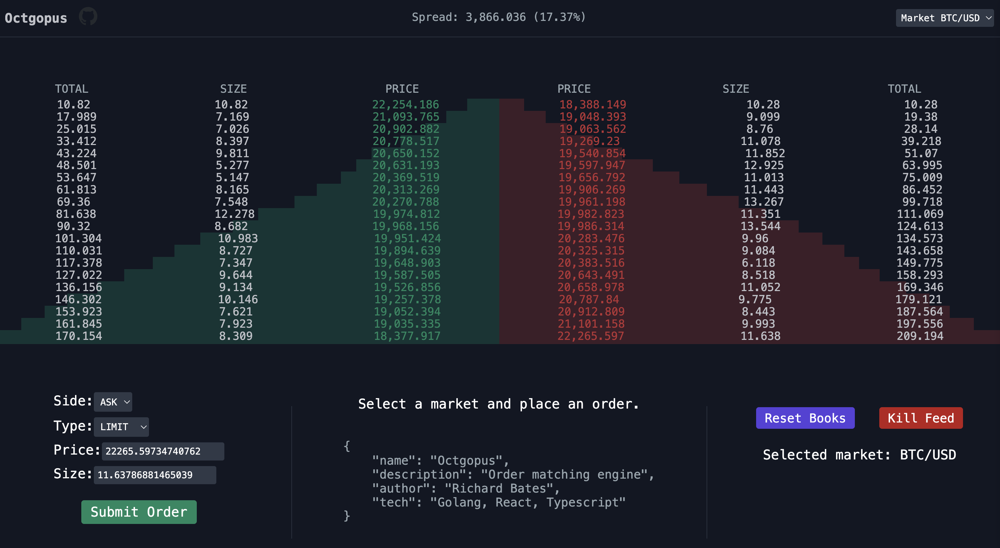

<h1 align="center">
  Octgopus
</h1>
<p align="center">
  Trading platform for submitting and matching orders, forked from the amazing <a href="https://github.com/mihailgaberov/orderbook/" target="_blank">@mihailgaberov</a>. 🐙
</p>
<p align="center">
  Built with React, Typescript and consumes a <a href="https://github.com/richo225/octgopus" target="_blank">Golang API</a> I built.
</p>

<p align="center">
  <a href="https://octgopus.up.railway.app" target="_blank">
    
  </a>
  <a href="https://github.com/richo225/octgopus" target="_blank">
    
  </a>
  <a href="https://github.com/richo225/orderbook/actions/workflows/ci.yml" target="_blank">
    
  </a>
  <a href="https://github.com/richo225/orderbook/blob/main/LICENSE.txt" target="_blank">
    
  </a>
</p>



## Backend

:chipmunk: [richo225/octgopus](https://github.com/richo225/octgopus/) :chipmunk:

## Demo

:star: [octgopus.up.railway.app](https://octgopus.up.railway.app/) :star:

## Installation

To run the app, follow these steps.

1. Ensure that [NodeJS](http://nodejs.org/)(16+) is installed.
2. Install [yarn](https://classic.yarnpkg.com/en/docs/install/#windows-stable/).
3. From the project folder, execute the following commands:

To install dependencies:

```shell
  yarn
```

To run the app:

```shell
  yarn start
```

To run the tests:

```shell
  yarn test
```